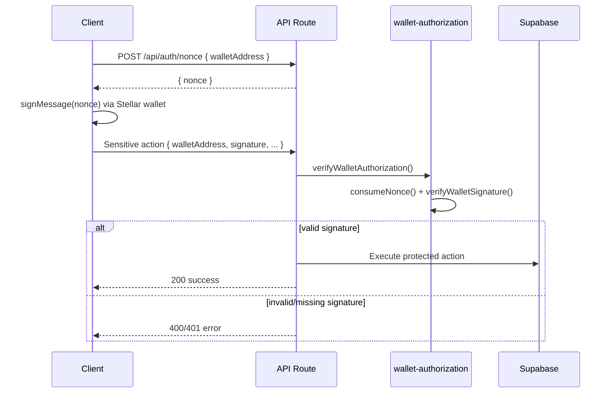

# Wallet Authorization for Sensitive Actions

This document describes how AnonChat protects critical group operations with
cryptographic wallet authorization beyond standard session authentication.

## Overview

Sensitive actions require the caller to prove wallet ownership by signing a
one-time server-issued nonce. The server verifies the Ed25519 signature before
executing the action.



## Protected Actions

| Action | Endpoint | Method | Owner Only |
|--------|----------|--------|------------|
| Delete group | `/api/groups/[id]` | `DELETE` | Yes |
| Transfer ownership | `/api/groups/[id]/transfer-ownership` | `POST` | Yes |
| Regenerate invite code | `/api/groups/[id]/invite` | `POST` | Yes |

## Request Flow

### 1. Request a nonce

```http
POST /api/auth/nonce
Content-Type: application/json

{ "walletAddress": "G..." }
```

Response:

```json
{ "nonce": "anonchat:1710000000000:uuid" }
```

Nonces expire after 5 minutes and are single-use.

### 2. Sign the nonce

Use the connected Stellar wallet to sign the nonce string. The signature must be
hex-encoded Ed25519 (as returned by the Stellar Wallets Kit).

### 3. Call the protected endpoint

Include `walletAddress` and `signature` in the JSON body alongside any
action-specific fields.

**Delete group:**

```http
DELETE /api/groups/{groupId}
Content-Type: application/json

{
  "walletAddress": "G...",
  "signature": "abc123..."
}
```

**Transfer ownership:**

```http
POST /api/groups/{groupId}/transfer-ownership

{
  "walletAddress": "G...",
  "signature": "abc123...",
  "newOwnerWalletAddress": "G..."
}
```

**Regenerate invite code:**

```http
POST /api/groups/{groupId}/invite

{
  "walletAddress": "G...",
  "signature": "abc123...",
  "expires_in": 86400,
  "max_uses": 10
}
```

## Middleware

Reusable verification lives in `lib/auth/wallet-authorization.ts`:

```typescript
import { verifyWalletAuthorization } from "@/lib/auth/wallet-authorization";

const auth = await verifyWalletAuthorization(
  { walletAddress, signature },
  "my_action_name",
);
if (!auth.ok) return auth.response;

// auth.walletAddress and auth.nonce are available
```

### Standardized error responses

| Condition | Status | Error message |
|-----------|--------|---------------|
| Invalid wallet address | 400 | Validation message from `validateWalletAddressWithMessage` |
| Missing signature | 400 | `signature is required` |
| Missing/expired nonce | 401 | `Nonce not found or expired. Request a new nonce first.` |
| Invalid signature | 401 | `Signature verification failed. Wallet ownership could not be proved.` |
| Wallet mismatch | 403 | `Wallet address does not match authenticated user` |
| Not group owner | 403 | Action-specific forbidden message |

### Audit logging

After a successful sensitive action, call `auditLog()` from
`lib/auth/signed-message-middleware.ts`:

```typescript
import { auditLog } from "@/lib/auth/signed-message-middleware";

auditLog("delete_group", walletAddress, { groupId });
```

## Adding new protected endpoints

1. Authenticate the user via Supabase session (`supabase.auth.getUser()`).
2. Parse `walletAddress` and `signature` from the request body.
3. Call `verifyWalletAuthorization()` with a descriptive action name.
4. Resolve the caller's wallet with `resolveWalletFromUser()` and verify it
   matches the signed wallet via `ensureWalletMatchesUser()`.
5. Enforce authorization rules (e.g. group owner check).
6. Perform the action and call `auditLog()`.

## Testing

Run unit tests:

```bash
pnpm run test:wallet-auth
```

Run API smoke tests (requires dev server):

```bash
pnpm dev
pnpm run test:sensitive-actions
```

## Security notes

- Nonces are stored in Redis (or in-memory fallback) and consumed on use to
  prevent replay attacks.
- Signatures are verified with `@stellar/stellar-sdk` Ed25519 verification.
- Session auth alone is insufficient for sensitive actions; wallet signature is
  always required.
- The signed wallet must match the authenticated user's profile wallet address.
